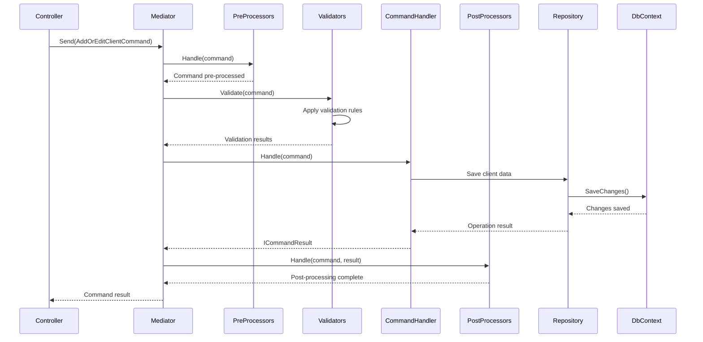
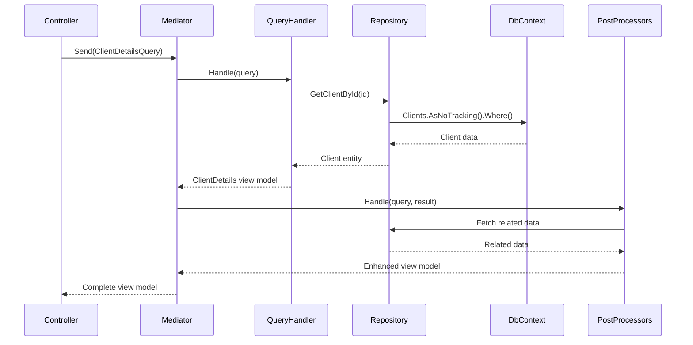

# Command Query Separation (CQRS) in Gringotts

The Gringotts application implements the Command Query Responsibility Segregation (CQRS) pattern to separate read operations (Queries) from write operations (Commands). This document outlines how CQRS is implemented in the application.

## Overview

CQRS splits the application's data operations into two distinct categories:

1. **Commands**: Operations that change state (create, update, delete)
2. **Queries**: Operations that read state without modifications

This separation allows for optimizing each path independently and makes the code more maintainable.

## Implementation

### Core Components

The CQRS implementation in Gringotts is built on top of the MediatR library and uses the following key components:

- **Commands**: Classes that implement `IAsyncRequest<ICommandResult>`
- **Command Handlers**: Classes that implement `IAsyncRequestHandler<TCommand, ICommandResult>`
- **Queries**: Classes that implement `IAsyncRequest<TResult>`
- **Query Handlers**: Classes that implement `IAsyncRequestHandler<TQuery, TResult>`
- **Pre/Post Processors**: Classes that implement `IAsyncPreRequestHandler<T>` and `IAsyncPostRequestHandler<TRequest, TResponse>`

### Command Structure

Commands typically follow this pattern:

```csharp
// Command class defines the intent and carries necessary data
public class AddOrEditClientCommand : IAsyncRequest<ICommandResult>
{
    public ModelStateDictionary ModelState { get; private set; }
    public ClientEditorForm Editor { get; private set; }

    public AddOrEditClientCommand(ClientEditorForm editor, ModelStateDictionary modelState)
    {
        this.ModelState = modelState;
        this.Editor = editor;
    }
}

// Command handler performs the operation
public class AddOrEditClientCommandHandler : IAsyncRequestHandler<AddOrEditClientCommand, ICommandResult>
{
    // Dependencies injected via constructor
    
    public async Task<ICommandResult> Handle(AddOrEditClientCommand message)
    {
        // Validation
        if (message.ModelState.NotValid())
            return new FailureResult("Validation Failed, please correct the errors below");

        // Dispatch to appropriate handler
        if (message.Editor.ClientId.HasValue)
            return await Edit(message);

        return await Add(message);
    }
    
    // Implementation details...
}
```

### Query Structure

Queries follow a similar pattern:

```csharp
// Query class defines what information is being requested
public class ClientDetailsQuery : IAsyncRequest<ClientDetails>
{
    public int ClientId { get; private set; }

    public ClientDetailsQuery(int clientId)
    {
        this.ClientId = clientId;
    }
}

// Query handler retrieves the requested information
public class ClientDetailsQueryHandler : IAsyncRequestHandler<ClientDetailsQuery, ClientDetails>
{
    // Dependencies injected via constructor
    
    public async Task<ClientDetails> Handle(ClientDetailsQuery query)
    {
        // Retrieve data
        var client = await clients.GetById(query.ClientId)
            .Include(c => c.Identifiers)
            .Include(c => c.Residencies)
            .AsNoTracking()
            .FirstOrDefaultAsync();

        // Transform to view model
        if (client != null)
            return new ClientDetails { ... };

        return null;
    }
}
```

## Class Diagram

The following class diagram illustrates the key types involved in the CQRS implementation:

```mermaid
classDiagram
    class IAsyncRequest~TResponse~ {
        <<interface>>
    }
    
    class IAsyncRequestHandler~TRequest, TResponse~ {
        <<interface>>
        +Handle(TRequest message) Task~TResponse~
    }
    
    class ICommandResult {
        <<interface>>
        +Success bool
        +Message string
    }
    
    class SuccessResult {
        +Success bool
        +Message string
        +RedirectUrl string
    }
    
    class FailureResult {
        +Success bool
        +Message string
    }
    
    class IAsyncPreRequestHandler~TRequest~ {
        <<interface>>
        +Handle(TRequest request) Task
    }
    
    class IAsyncPostRequestHandler~TRequest, TResponse~ {
        <<interface>>
        +Handle(TRequest request, TResponse response) Task
    }
    
    class CommandValidator~TCommand~ {
        #Validators Action~TCommand~[]
        +Validate(TCommand command)
    }
    
    class AsyncMediatorPipeline~TRequest, TResponse~ {
        -preRequestHandlers IAsyncPreRequestHandler~TRequest~[]
        -inner IAsyncRequestHandler~TRequest, TResponse~
        -postRequestHandlers IAsyncPostRequestHandler~TRequest, TResponse~[]
        +Handle(TRequest message) Task~TResponse~
    }
    
    class Command {
        <<example>>
        +AddOrEditClientCommand
        +DeleteClientCommand
        +CreateAccountCommand
    }
    
    class CommandHandler {
        <<example>>
        +AddOrEditClientCommandHandler
        +DeleteClientCommandHandler
        +CreateAccountCommandHandler
    }
    
    class Query {
        <<example>>
        +ClientDetailsQuery
        +AccountListQuery
        +DashboardDataQuery
    }
    
    class QueryHandler {
        <<example>>
        +ClientDetailsQueryHandler
        +AccountListQueryHandler
        +DashboardDataQueryHandler
    }
    
    IAsyncRequest~TResponse~ <|-- Command
    IAsyncRequest~TResponse~ <|-- Query
    IAsyncRequestHandler~TRequest, TResponse~ <|-- CommandHandler
    IAsyncRequestHandler~TRequest, TResponse~ <|-- QueryHandler
    IAsyncRequestHandler~TRequest, TResponse~ <|-- AsyncMediatorPipeline~TRequest, TResponse~
    ICommandResult <|-- SuccessResult
    ICommandResult <|-- FailureResult
    IAsyncPreRequestHandler~TRequest~ <|-- CommandValidator~TCommand~
    Command --> CommandHandler: handled by
    Query --> QueryHandler: handled by
```



## Sequence Diagram

The following sequence diagram illustrates the flow of processing a command through the MediatR pipeline:



For queries, the flow is similar but simpler, typically involving fewer pre-processors and focusing on optimized data retrieval:



## Pipeline Extensions

The Gringotts implementation enhances the basic CQRS pattern with a pipeline for pre and post-processing:

### Pre-Processing

Used for operations that need to happen before a command or query is processed:

```csharp
public class ClientEditorFormImageHandler : IAsyncPreRequestHandler<AddOrEditClientCommand>
{
    public async Task Handle(AddOrEditClientCommand request)
    {
        // Process and store client image before command handler runs
        if (request.Editor.Image != null && request.Editor.Image.ContentLength > 0)
        {
            request.Editor.ImageId = await StoreImage(request.Editor);
        }
    }
}
```

### Validation

A specialized type of pre-processing used for validation logic:

```csharp
public class ClientEditorFormIdentifierValidatorHandler : CommandValidator<AddOrEditClientCommand>
{
    public ClientEditorFormIdentifierValidatorHandler(ApplicationDbContext dbContext)
    {
        this.dbContext = dbContext;
        Validators = new Action<AddOrEditClientCommand>[]
        {
            EnsureIdentifierTypesAreDistinct, 
            EnsureSSNIdentifiersAreValid, 
            EnsureIdentifiersAreNotInUse
        };
    }
    
    // Validator methods...
}
```

### Post-Processing

Used for operations that need to happen after a command or query has been processed:

```csharp
public class ClientDetailsAccountsPostProcessor: IAsyncPostRequestHandler<ClientDetailsQuery, ClientDetails>
{
    public async Task Handle(ClientDetailsQuery command, ClientDetails response)
    {
        // Enhance query results with additional data
        if (response == null)
            return;

        response.Accounts = await accounts.All()
            .Where(a => a.Residency.Client.Id == response.Client.Id)
            .AsNoTracking()
            .ToArrayAsync();
    }
}
```

## Mediator Pipeline

All commands and queries are processed through `AsyncMediatorPipeline`, which orchestrates the execution of pre-handlers, the main handler, and post-handlers:

```csharp
public class AsyncMediatorPipeline<TRequest, TResponse> : IAsyncRequestHandler<TRequest, TResponse> 
    where TRequest : IAsyncRequest<TResponse>
{
    public async Task<TResponse> Handle(TRequest message)
    {
        // Execute pre-handlers
        foreach (var preRequestHandler in preRequestHandlers)
        {
             await preRequestHandler.Handle(message);
        }

        // Execute main handler
        var result = await inner.Handle(message);

        // Execute post-handlers
        if (result != null)
        {
            foreach (var postRequestHandler in postRequestHandlers)
            {
                await postRequestHandler.Handle(message, result);
            }
        }

        return result;
    }
}
```

## Benefits in Gringotts

1. **Separation of Concerns**: Read and write logic are cleanly separated
2. **Extensibility**: New validators, pre-processors, and post-processors can be added without modifying existing code
3. **Testability**: Each component can be tested in isolation
4. **Maintainability**: Business logic is neatly organized into focused classes
5. **Performance Optimization**: Query paths can be optimized for reading with `AsNoTracking()` and other techniques

## Best Practices

When working with the CQRS pattern in Gringotts:

1. Commands should return `ICommandResult` to indicate success/failure
2. Queries should return data transfer objects (not domain entities)
3. Use `AsNoTracking()` in query handlers for better performance
4. Use validators for input validation
5. Use post-processors to enrich view models with related data
6. Keep command and query handlers focused on a single responsibility
