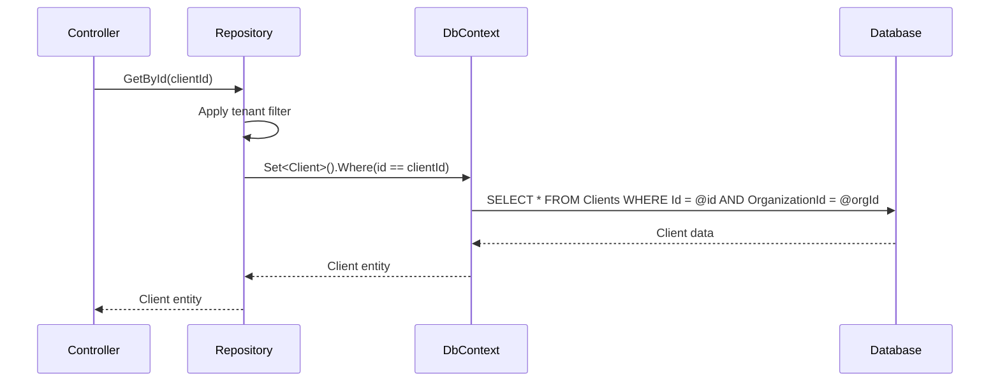
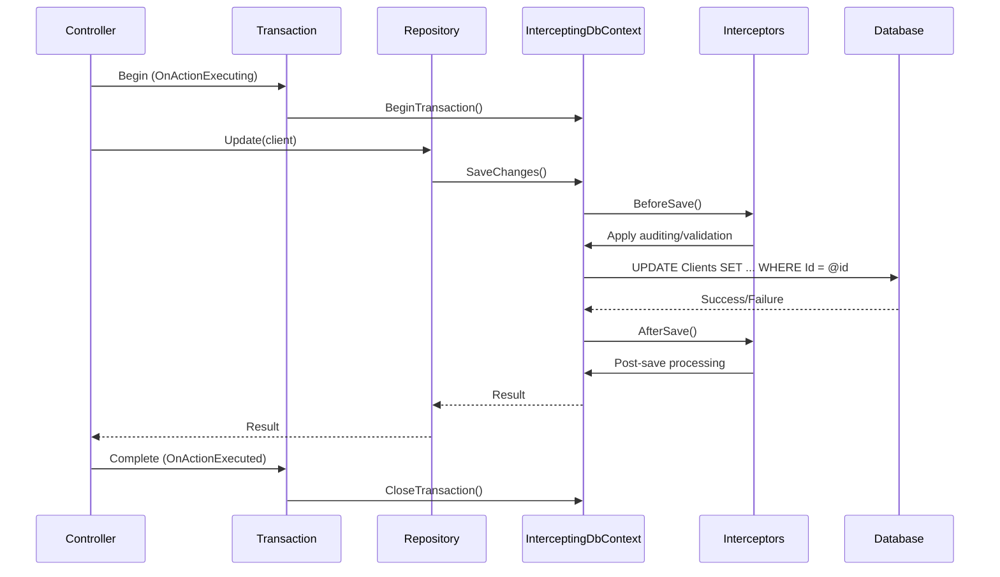

# Data Access Patterns in Gringotts

This document outlines the data access architecture used in the Gringotts Financial application.

## Overview

Gringotts uses Entity Framework as its primary ORM with a multi-layered data access approach. The architecture combines the Repository Pattern with Unit of Work pattern to abstract database operations and provide a clean separation between business logic and data access.

## Architecture Components

### Core Components

1. **DbContext** - `ApplicationDbContext` serves as the primary unit of work and Entity Framework context
2. **Repositories** - Type-specific repositories that encapsulate data access logic
3. **IUnitOfWork** - Provides transaction management capabilities
4. **Interceptors** - Add cross-cutting concerns like auditing to data operations
5. **Entity Configurations** - Fluent API configurations for relationships and constraints

## Entity Framework Implementation

### ApplicationDbContext

The application uses a central DbContext class that registers all entity configurations and manages database connections:

```csharp
public class ApplicationDbContext : DbContext, IUnitOfWork
{
    // Configuration settings for Entity Framework
    public ApplicationDbContext() : base("DefaultConnection")
    {
        Database.SetInitializer(new SeedDataInitializer());
        Configuration.LazyLoadingEnabled = true;
    }

    // Entity Sets
    public virtual IDbSet<Organization> Organizations { get; set; }
    public virtual IDbSet<Client> Clients { get; set; }
    public virtual IDbSet<Account> Accounts { get; set; }
    public virtual IDbSet<Transaction> Transactions { get; set; }
    // Other entity sets...

    protected override void OnModelCreating(DbModelBuilder modelBuilder)
    {
        // Add custom conventions
        modelBuilder.Conventions.Add(new PrimaryKeyNamingConvention());
        modelBuilder.Conventions.Add(new ForeignKeyNamingConvention());
        
        // Register entity configurations
        modelBuilder.Configurations.Add(new AccountConfiguration());
        modelBuilder.Configurations.Add(new ResidencyConfiguration());
        // Other configurations...
    }

    // IUnitOfWork implementation for transaction management
    void IUnitOfWork.BeginTransaction() { /* Implementation */ }
    void IUnitOfWork.CloseTransaction() { /* Implementation */ }
    void IUnitOfWork.CloseTransaction(Exception exception) { /* Implementation */ }
}
```

### Entity Configurations

Entity configurations use the Fluent API to define relationships, constraints, and indexes:

```csharp
public class ResidencyConfiguration : EntityTypeConfiguration<Residency>
{
    public ResidencyConfiguration()
    {
        // Define primary key
        HasKey(r => r.Id);
        
        // Configure relationships
        HasRequired(r => r.Client)
            .WithMany(c => c.Residencies)
            .HasForeignKey(r => r.ClientId);
            
        HasRequired(r => r.Organization)
            .WithMany()
            .HasForeignKey(r => r.OrganizationId);
    }
}
```

## Repository Pattern

### ISearch<T> Interface

Gringotts implements a generic repository pattern through the `ISearch<T>` interface:

```csharp
public interface ISearch<T> where T : class
{
    IQueryable<T> All();
    IQueryable<T> GetById(int id);
    IQueryable<T> GetBySearch(SearchPager pager);
}
```

Repository implementations provide type-specific data access logic while adhering to this common interface.

## Interception and Cross-Cutting Concerns

### Data Interceptors

The application uses an interception mechanism to apply cross-cutting concerns to data operations:

```csharp
public class InterceptingApplicationDbContext : ApplicationDbContext
{
    private readonly IEnumerable<IInterceptor> interceptors;

    public InterceptingApplicationDbContext(Lazy<IEnumerable<IInterceptor>> interceptors, 
        DbConnection connection) : base(connection)
    {
        this.interceptors = interceptors.Value;
    }

    public override int SaveChanges()
    {
        var context = CreateInterceptionContext();
        
        // Apply pre-save interceptors
        foreach (var interceptor in interceptors)
            interceptor.BeforeSave(context);
            
        var result = base.SaveChanges();
        
        // Apply post-save interceptors
        foreach (var interceptor in interceptors)
            interceptor.AfterSave(context);
            
        return result;
    }
    
    // Async version also available...
}
```

### AuditChangeInterceptor

A key interceptor is the `AuditChangeInterceptor` which automatically populates created/updated timestamps and user information:

```csharp
public class AuditChangeInterceptor : IInterceptor
{
    private readonly IPrincipalProvider principalProvider;
    
    public AuditChangeInterceptor(IPrincipalProvider principalProvider)
    {
        this.principalProvider = principalProvider;
    }
    
    public void BeforeSave(InterceptionContext context)
    {
        var username = principalProvider.GetCurrent()?.Identity?.Name ?? "System";
        var timestamp = DateTime.UtcNow;
        
        foreach (var entry in context.Entries)
        {
            if (entry.Entity is IAmAuditable auditableEntity)
            {
                if (entry.State == EntityState.Added)
                {
                    auditableEntity.Created = timestamp;
                    auditableEntity.CreatedBy = username;
                }
                
                auditableEntity.Updated = timestamp;
                auditableEntity.UpdatedBy = username;
            }
        }
    }
    
    public void AfterSave(InterceptionContext context) { }
}
```

## Multi-tenancy Support

The application implements multi-tenancy at the data layer:

1. **Tenant Context**: Using `ITenantOrganizationProvider` to identify the current organization
2. **Data Filtering**: Automatically applying organization filters to all repository queries
3. **Organization Entity**: All organization-specific entities implement `IBelongToOrganization`

## Class Diagram

The following class diagram illustrates the key types in the data access layer and their relationships:

```mermaid
classDiagram
    class DbContext {
        <<abstract>>
        +SaveChanges() int
        +SaveChangesAsync() Task~int~
        +Set~T~() DbSet~T~
    }
    
    class ApplicationDbContext {
        +Organizations IDbSet~Organization~
        +Clients IDbSet~Client~
        +Accounts IDbSet~Account~
        +Transactions IDbSet~Transaction~
        #OnModelCreating(DbModelBuilder)
    }
    
    class InterceptingApplicationDbContext {
        -interceptors IEnumerable~IInterceptor~
        +SaveChanges() int
        +SaveChangesAsync() Task~int~
        #CreateInterceptionContext() InterceptionContext
    }
    
    class IUnitOfWork {
        <<interface>>
        +BeginTransaction() void
        +CloseTransaction() void
        +CloseTransaction(Exception) void
    }
    
    class IInterceptor {
        <<interface>>
        +BeforeSave(InterceptionContext) void
        +AfterSave(InterceptionContext) void
    }
    
    class AuditChangeInterceptor {
        +BeforeSave(InterceptionContext) void
        +AfterSave(InterceptionContext) void
    }
    
    class ISearch~T~ {
        <<interface>>
        +All() IQueryable~T~
        +GetById(int) IQueryable~T~
        +GetBySearch(SearchPager) IQueryable~T~
    }
    
    class Repository~T~ {
        <<abstract>>
        #dbContext ApplicationDbContext
        +All() IQueryable~T~
        +GetById(int) IQueryable~T~
        +GetBySearch(SearchPager) IQueryable~T~
    }
    
    class ClientRepository {
        +FindByName(string, string) Task~IEnumerable~Client~~
        +GetActiveClients() IQueryable~Client~
    }
    
    class AccountRepository {
        +GetAccountsForClient(int) IQueryable~Account~
        +GetActiveAccounts() IQueryable~Account~
    }
    
    class IBelongToOrganization {
        <<interface>>
        +OrganizationId int
    }
    
    class IAmAuditable {
        <<interface>>
        +Created DateTime
        +CreatedBy string
        +Updated DateTime
        +UpdatedBy string
    }
    
    class Transaction {
        <<ActionFilter>>
        +OnActionExecuting(ActionExecutingContext)
        +OnActionExecuted(ActionExecutedContext)
    }
    
    class ITenantOrganizationProvider {
        <<interface>>
        +GetCurrentOrganizationId() int
    }
    
    DbContext <|-- ApplicationDbContext
    ApplicationDbContext <|-- InterceptingApplicationDbContext
    ApplicationDbContext ..|> IUnitOfWork
    IInterceptor <|.. AuditChangeInterceptor
    ISearch~T~ <|.. Repository~T~
    Repository~T~ <|-- ClientRepository
    Repository~T~ <|-- AccountRepository
    Transaction --> IUnitOfWork
```



## Sequence Diagrams

### Data Retrieval Flow

This sequence diagram shows how data is retrieved through the repository pattern:



### Data Modification Flow

This sequence diagram illustrates the flow of saving changes with interception:



## Transaction Management

The application uses a transaction filter attribute to ensure database consistency:

```csharp
public class Transaction : ActionFilterAttribute
{
    private readonly IUnitOfWork unitOfWork;
    
    public Transaction(IUnitOfWork unitOfWork)
    {
        this.unitOfWork = unitOfWork;
    }
    
    public override void OnActionExecuting(ActionExecutingContext filterContext)
    {
        unitOfWork.BeginTransaction();
    }
    
    public override void OnActionExecuted(ActionExecutedContext filterContext)
    {
        unitOfWork.CloseTransaction(filterContext.Exception);
    }
}
```

## Performance Optimization Techniques

1. **AsNoTracking()**: Used for read-only operations to improve performance
2. **Eager Loading**: Using `Include()` to load related entities when needed
3. **Projection**: Using LINQ `Select()` to retrieve only required fields
4. **Pagination**: Implementing paging with `Skip()` and `Take()`

## Best Practices

When working with the data access layer in Gringotts:

1. **Use Repositories**: Access data through the appropriate repository interfaces
2. **Apply Multi-tenancy**: Always respect organizational boundaries in queries
3. **Leverage Eager Loading**: Use Include() to avoid N+1 query problems
4. **Ensure Disposal**: Use using statements or dependency injection to manage context lifecycles
5. **Implement Validation**: Validate data before saving to avoid constraint violations
6. **Respect Transactions**: Use transaction attributes on controllers that modify data
