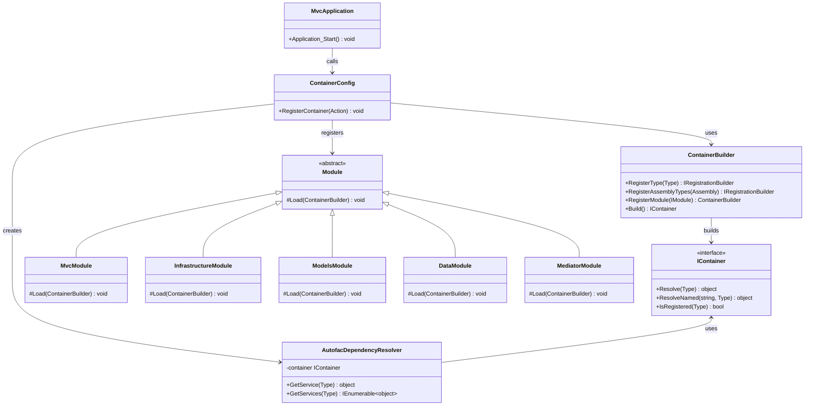
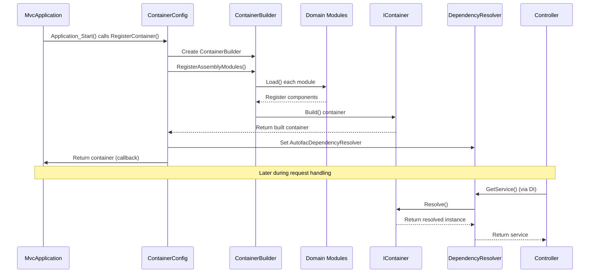

# Dependency Injection in Gringotts

This document outlines the Dependency Injection (DI) architecture implemented in the Gringotts Financial application.

## Overview

Gringotts uses Autofac as its IoC container to manage dependencies throughout the application. The DI implementation follows a modular approach with component registration organized by functionality domains, allowing for clear separation of concerns and easier testing.

## Architecture Components

### Key Components

1. **ContainerConfig** - Bootstrap class that builds and configures the Autofac container
2. **Modules** - Domain-specific Autofac modules that register related components 
3. **Integration Components** - Third-party integrations like NLog and Glimpse
4. **Lifetime Scopes** - Control of object lifetime (per request, singleton, etc.)

## Implementation

### Container Configuration

The application's DI container is configured in the `ContainerConfig` class, which is called during application startup:

```csharp
public class ContainerConfig
{
    public static void RegisterContainer(Action<IContainer> onReady)
    {
        var builder = new ContainerBuilder();

        // Add application modules, one per assembly
        builder.RegisterAssemblyModules(typeof(MvcApplication).Assembly);

        // Add 3rd party integration modules
        builder.RegisterModule<NLogModule>();
        builder.RegisterModule<SimpleNLogModule>();

        var container = builder.Build();

        // Add 3rd party integrations without Autofac modules
        container.ActivateGlimpse();

        DependencyResolver.SetResolver(new AutofacDependencyResolver(container));

        onReady(container);
    }
}
```

### Module Structure

The application is organized into domain-specific Autofac modules, each responsible for registering related components:

1. **MvcModule** - Registers MVC components like controllers, model binders, and global filters
2. **InfrastructureModule** - Registers cross-cutting utilities and services
3. **ModelsModule** - Registers domain models and related services
4. **DataModule** - Registers data access components
5. **MediatorModule** - Registers components for the Mediator pattern

Example of a domain-specific module:

```csharp
public class DataModule : Module
{
    protected override void Load(ContainerBuilder builder)
    {
        builder.RegisterType<InterceptingApplicationDbContext>()
            .AsImplementedInterfaces()
            .As<ApplicationDbContext>()
            .AsSelf()
            .InstancePerLifetimeScope();

        builder.RegisterGeneric(typeof(Lookup<>))
            .As(typeof(ILookup<>))
            .InstancePerLifetimeScope();

        builder.RegisterType<AuditChangeInterceptor>()
            .As<IInterceptor>();

        builder.RegisterType<TenantOrganizationInterceptor>()
            .As<IInterceptor>();
    }
}
```

## Module Registration Patterns

### Infrastructure Registration

The `InfrastructureModule` uses a convention-based approach to register components:

```csharp
public class InfrastructureModule : Module
{
    protected override void Load(ContainerBuilder builder)
    {
        builder.RegisterAssemblyTypes(Assembly.GetExecutingAssembly())
            .Where(type => !string.IsNullOrWhiteSpace(type.Namespace))
            .Where(type => type.Namespace.Contains(this.GetType().Namespace))
            .AsImplementedInterfaces()
            .InstancePerLifetimeScope()
            .AsSelf();
    }
}
```

### Generic Component Registration

For registering generic components, the application uses a specialized approach:

```csharp
// From ModelsModule.cs
builder.RegisterAssemblyTypes(Assembly.GetExecutingAssembly())
    .As(type => type.GetInterfaces()
        .Where(interfacetype => interfacetype.IsClosedTypeOf(typeof(ISearch<>))));
```

### Mediator Pattern Integration

The `MediatorModule` handles registration of components for the CQRS pattern:

```csharp
// Register command and query handlers
builder.RegisterAssemblyTypes(Assembly.GetExecutingAssembly())
    .As(type => type.IsAssignableTo<IDisable>() ? 
        new[] { new KeyedService("disabled", typeof(IDisable)) } : 
        type.GetInterfaces()
            .Where(interfaceType => interfaceType.IsClosedTypeOf(typeof(IAsyncRequestHandler<,>)))
            .Select(interfaceType => new KeyedService("asyncRequestHandler", interfaceType)));

// Register pipeline decorators
builder.RegisterGenericDecorator(
    typeof(AsyncMediatorPipeline<,>), 
    typeof(IAsyncRequestHandler<,>), 
    "asyncRequestHandler");
```

## Lifetime Management

The application uses various lifetimes to manage object instances:

1. **InstancePerLifetimeScope** - Most services use this scope (equivalent to "per request" in web applications)
2. **SingleInstance** - Used for application-wide singletons like configuration or monitoring
3. **InstancePerDependency** - Rarely used, creates a new instance for each dependency

Example in `MvcModule`:

```csharp
builder.RegisterType<EnvironmentMonitor>()
    .AsImplementedInterfaces()
    .SingleInstance();
```

## Third-Party Integrations

### Logging Integration

NLog is integrated using Autofac modules:

```csharp
// In ContainerConfig.cs
builder.RegisterModule<NLogModule>(); // Main NLog integration
builder.RegisterModule<SimpleNLogModule>(); // For action filters
```

### MVC Integration

The Autofac integration with MVC is configured in the `MvcModule`:

```csharp
builder.RegisterControllers(assembly)
    .PropertiesAutowired();
builder.RegisterModelBinders(assembly)
    .PropertiesAutowired();
builder.RegisterFilterProvider();
builder.RegisterModelBinderProvider();
builder.RegisterModule<AutofacWebTypesModule>();
```

## Class Diagram

The following class diagram illustrates the key types in the dependency injection architecture:



## Sequence Diagram

The following sequence diagram illustrates the container setup and dependency resolution flow:



## Testing Support

The DI architecture facilitates testing through easy component substitution. The test project uses a combination of real and mock dependencies:

```csharp
[TestMethod]
public void Can_build_container()
{
    ContainerConfig.RegisterContainer(container =>
    {
        Assert.IsNotNull(container);
        Assert.IsTrue(container.IsRegistered<ILogger>(), "can get a logger");
        Assert.IsTrue(container.IsRegistered<IMediator>(), "can get a mediator");
    });
}
```

## Best Practices

When working with dependency injection in Gringotts:

1. **Interface-Based Design** - Components should depend on interfaces, not concrete implementations
2. **Single Responsibility** - Each module should focus on registering components from a single domain
3. **Constructor Injection** - Prefer constructor injection over property or method injection
4. **Explicit Registration** - Prefer explicit registration over convention-based for critical components
5. **Lifetime Management** - Be mindful of component lifetimes to avoid memory leaks
6. **Decorators** - Use decorators to add cross-cutting concerns without modifying original components
