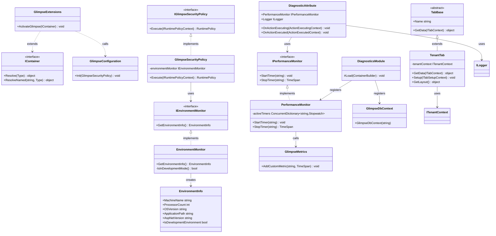
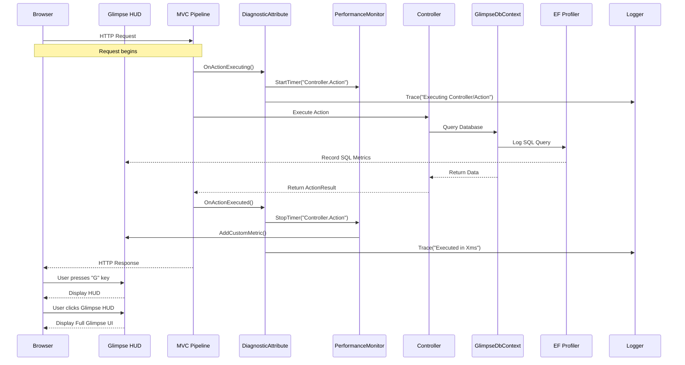

# Diagnostics in Gringotts

This document outlines the diagnostics architecture implemented in the Gringotts Financial application, focusing on how the application handles profiling, monitoring, and debugging.

## Overview

Gringotts uses a comprehensive diagnostics strategy centered around Glimpse, along with NLog for logging, and custom diagnostic components to provide detailed insights into application behavior, performance, and errors.

## Glimpse Integration

### What is Glimpse?

[Glimpse](http://getglimpse.com/) is an open-source diagnostics platform for the web that provides real-time diagnostics and insights to help you debug and optimize your application. It acts like a client-side debugger and profiler combined into one easily accessible tool.

### Accessing Glimpse

Glimpse is accessible in several ways within Gringotts:

1. **Glimpse HUD (Heads-Up Display)**: Press the `G` key when browsing the application to toggle the Glimpse HUD in the bottom right corner
2. **Glimpse Timeline**: Access detailed timing information at `/Glimpse.axd`
3. **Glimpse Configuration**: Configure Glimpse at `/Glimpse.axd?n=config`

### Key Features Utilized

- **Request Timeline**: Detailed breakdown of request execution time
- **SQL Query Profiling**: Logging and timing of all database queries
- **MVC Insights**: Controller/action selection, model binding, and view rendering details
- **Ajax Requests**: Monitoring and inspection of AJAX calls
- **Environment Information**: Server, browser, and request details

## Architecture Components

### Key Components

1. **GlimpseActivator** - Responsible for setting up and activating Glimpse during application startup
2. **DiagnosticsModule** - Autofac module that registers diagnostic components
3. **PerformanceMonitor** - Custom component for capturing and reporting performance metrics
4. **EnvironmentMonitor** - Provides system and application environment information
5. **GlimpseSecurityPolicy** - Controls Glimpse access permissions

## Implementation

### Glimpse Activation

The application activates Glimpse during container setup:

```csharp
public static class GlimpseExtensions
{
    public static void ActivateGlimpse(this IContainer container)
    {
        // Register Glimpse services with Autofac
        var builder = new ContainerBuilder();
        
        builder.RegisterType<GlimpseSecurityPolicy>()
            .AsSelf()
            .AsImplementedInterfaces()
            .SingleInstance();
            
        builder.RegisterType<EnvironmentMonitor>()
            .AsSelf()
            .AsImplementedInterfaces()
            .SingleInstance();
            
        builder.Update(container);
        
        // Initialize Glimpse with our components
        GlimpseConfiguration.Init(container.Resolve<GlimpseSecurityPolicy>());
    }
}
```

### Custom Performance Monitoring

Gringotts extends Glimpse with custom performance monitoring:

```csharp
public class PerformanceMonitor : IPerformanceMonitor
{
    private readonly ConcurrentDictionary<string, Stopwatch> _activeTimers = 
        new ConcurrentDictionary<string, Stopwatch>();
    
    public void StartTimer(string timerName)
    {
        var timer = new Stopwatch();
        timer.Start();
        _activeTimers.AddOrUpdate(timerName, timer, (key, existingTimer) => timer);
    }
    
    public TimeSpan StopTimer(string timerName)
    {
        Stopwatch timer;
        if (_activeTimers.TryRemove(timerName, out timer))
        {
            timer.Stop();
            GlimpseMetrics.AddCustomMetric(timerName, timer.Elapsed);
            return timer.Elapsed;
        }
        
        return TimeSpan.Zero;
    }
}
```

### Environment Information

The application provides environment information for diagnostic purposes:

```csharp
public class EnvironmentMonitor : IEnvironmentMonitor
{
    public EnvironmentInfo GetEnvironmentInfo()
    {
        return new EnvironmentInfo
        {
            MachineName = Environment.MachineName,
            ProcessorCount = Environment.ProcessorCount,
            OSVersion = Environment.OSVersion.ToString(),
            ApplicationPath = AppDomain.CurrentDomain.BaseDirectory,
            AspNetVersion = RuntimeEnvironment.GetSystemVersion(),
            IsDevelopmentEnvironment = IsInDevelopmentMode()
        };
    }
    
    private bool IsInDevelopmentMode()
    {
        bool isDevelopment = false;
        bool.TryParse(ConfigurationManager.AppSettings["Development"], out isDevelopment);
        return isDevelopment || Debugger.IsAttached;
    }
}
```

### Glimpse Security Policy

Access to Glimpse is controlled through a custom security policy:

```csharp
public class GlimpseSecurityPolicy : IGlimpseSecurityPolicy
{
    private readonly IEnvironmentMonitor _environmentMonitor;
    
    public GlimpseSecurityPolicy(IEnvironmentMonitor environmentMonitor)
    {
        _environmentMonitor = environmentMonitor;
    }
    
    public RuntimePolicy Execute(IRuntimePolicyContext policyContext)
    {
        // Always allow Glimpse in development
        if (_environmentMonitor.GetEnvironmentInfo().IsDevelopmentEnvironment)
            return RuntimePolicy.On;
            
        // Only allow from local requests in production
        var httpContext = policyContext.GetHttpContext();
        if (httpContext.Request.IsLocal)
            return RuntimePolicy.On;
            
        // Admin users can access Glimpse in production
        if (httpContext.User.IsInRole("Administrator"))
            return RuntimePolicy.On;
            
        return RuntimePolicy.Off;
    }
}
```

### MVC Integration

The application extends the diagnostic capabilities into the MVC controllers:

```csharp
[AttributeUsage(AttributeTargets.Class | AttributeTargets.Method)]
public class DiagnosticAttribute : ActionFilterAttribute
{
    public IPerformanceMonitor PerformanceMonitor { get; set; }
    public ILogger Logger { get; set; }
    
    public override void OnActionExecuting(ActionExecutingContext filterContext)
    {
        var controller = filterContext.ActionDescriptor.ControllerDescriptor.ControllerName;
        var action = filterContext.ActionDescriptor.ActionName;
        var timerName = $"Controller.{controller}.{action}";
        
        PerformanceMonitor.StartTimer(timerName);
        Logger.Trace($"Executing {controller}/{action}");
        
        base.OnActionExecuting(filterContext);
    }
    
    public override void OnActionExecuted(ActionExecutedContext filterContext)
    {
        var controller = filterContext.ActionDescriptor.ControllerDescriptor.ControllerName;
        var action = filterContext.ActionDescriptor.ActionName;
        var timerName = $"Controller.{controller}.{action}";
        
        var elapsed = PerformanceMonitor.StopTimer(timerName);
        Logger.Trace($"Executed {controller}/{action} in {elapsed.TotalMilliseconds:F2}ms");
        
        base.OnActionExecuted(filterContext);
    }
}
```

### Entity Framework Profiling

Database operations are profiled using Glimpse's EF integration:

```csharp
public class DiagnosticsModule : Module
{
    protected override void Load(ContainerBuilder builder)
    {
        // Register the EF DbContext with Glimpse profiling
        builder.Register(c => 
                new GlimpseDbContext(
                    ConfigurationManager.ConnectionStrings["DefaultConnection"].ConnectionString))
            .As<DbContext>()
            .As<ApplicationDbContext>()
            .InstancePerLifetimeScope();
            
        // Register performance monitors
        builder.RegisterType<PerformanceMonitor>()
            .AsImplementedInterfaces()
            .SingleInstance();
    }
}
```

### Glimpse Custom Tabs

The application extends Glimpse with custom tabs for application-specific information:

```csharp
public class TenantTab : TabBase, ITabSetup, ITabLayout
{
    public override string Name => "Tenants";
    
    private readonly ITenantContext _tenantContext;
    
    public TenantTab(ITenantContext tenantContext)
    {
        _tenantContext = tenantContext;
    }
    
    public override object GetData(ITabContext context)
    {
        var tenant = _tenantContext.CurrentTenant;
        return new
        {
            TenantId = tenant.Id,
            Name = tenant.Name,
            Domain = tenant.Domain,
            IsActive = tenant.IsActive,
            CreatedAt = tenant.CreatedAt,
            LastAccessed = tenant.LastAccess
        };
    }
    
    public void Setup(ITabSetupContext context)
    {
        context.PersistMessages = true;
    }
    
    public object GetLayout()
    {
        return new TabLayout
        {
            Sections = new[]
            {
                new TabSection("Current Tenant", new[] {
                    new TabSection.Row { new[] { new TabSection.Cell("ID"), new TabSection.Cell("TenantId") } },
                    new TabSection.Row { new[] { new TabSection.Cell("Name"), new TabSection.Cell("Name") } },
                    new TabSection.Row { new[] { new TabSection.Cell("Domain"), new TabSection.Cell("Domain") } },
                    new TabSection.Row { new[] { new TabSection.Cell("Is Active"), new TabSection.Cell("IsActive") } },
                    new TabSection.Row { new[] { new TabSection.Cell("Created"), new TabSection.Cell("CreatedAt") } },
                    new TabSection.Row { new[] { new TabSection.Cell("Last Access"), new TabSection.Cell("LastAccessed") } },
                })
            }
        };
    }
}
```

## Class Diagram

The following class diagram illustrates the key types in the diagnostics architecture:



## Sequence Diagram

The following sequence diagram illustrates the flow of diagnostics through a typical request:



## Using Glimpse Effectively

### 1. Accessing Glimpse in Gringotts

To access Glimpse in the Gringotts application:

1. **Keyboard Shortcut**: Press the `G` key while browsing any page in the application
2. **Direct URL**: Navigate to `/Glimpse.axd` for the full Glimpse interface
3. **HUD**: Look for the small Glimpse icon in the bottom-right corner of the page

### 2. Interpreting the Glimpse Timeline

The timeline provides a visual representation of the request execution:


* **Timeline Bars**: Color-coded segments representing different phases of request execution
* **Timeline Events**: Markers indicating specific events during the request
* **Hover Details**: Detailed timing information when hovering over segments

### 3. Analyzing SQL Queries

The SQL tab shows all database queries executed during a request:

* **Query Text**: The actual SQL executed
* **Parameters**: Values used in parameterized queries
* **Duration**: How long each query took to execute
* **Connection Info**: Database connection details

### 4. Examining MVC Actions

The MVC tab provides insights into controller and action execution:

* **Action Selection**: Which controller/action was selected and why
* **Model Binding**: Details about model binding process and values
* **Result Execution**: Information about view rendering or result generation

### 5. Extending Glimpse

Developers can extend Glimpse in Gringotts by:

1. Creating custom tabs (like the TenantTab example)
2. Adding custom metrics via `GlimpseMetrics.AddCustomMetric()`
3. Creating custom Glimpse plugins for domain-specific monitoring

## External Resources

* [Glimpse Official Documentation](http://getglimpse.com/Docs/)
* [Glimpse GitHub Repository](https://github.com/Glimpse/Glimpse)
* [Glimpse NuGet Package](https://www.nuget.org/packages/Glimpse/)
* [Glimpse Extensions](https://www.nuget.org/packages?q=Glimpse)

## Known Issues with Glimpse

As noted in the project's [CHEAT_SHEET.md](CHEAT_SHEET.md), Glimpse is currently tagged as deprecated:

> [Glimpse](https://www.nuget.org/packages/Glimpse/1.8.6) | 1.8.6 | Diagnostics and debugging | ⚠️ [Deprecated](https://www.nuget.org/packages/Glimpse/) - Last updated in 2015

Consider the following recommendations:

1. **Short-term**: Continue using Glimpse with caution, understanding it's no longer maintained
2. **Medium-term**: Consider migrating to Application Insights for more modern diagnostics
3. **Long-term**: Implement a comprehensive monitoring strategy using current technologies like OpenTelemetry

## Best Practices

When working with diagnostics in Gringotts:

1. **Use the DiagnosticAttribute** on controllers or actions that require detailed monitoring
2. **Add custom metrics** for business-critical operations
3. **Check Glimpse regularly** during development to identify performance bottlenecks
4. **Enable Glimpse selectively in production** only for administrators or when troubleshooting
5. **Combine Glimpse with NLog** for a comprehensive view of application behavior
