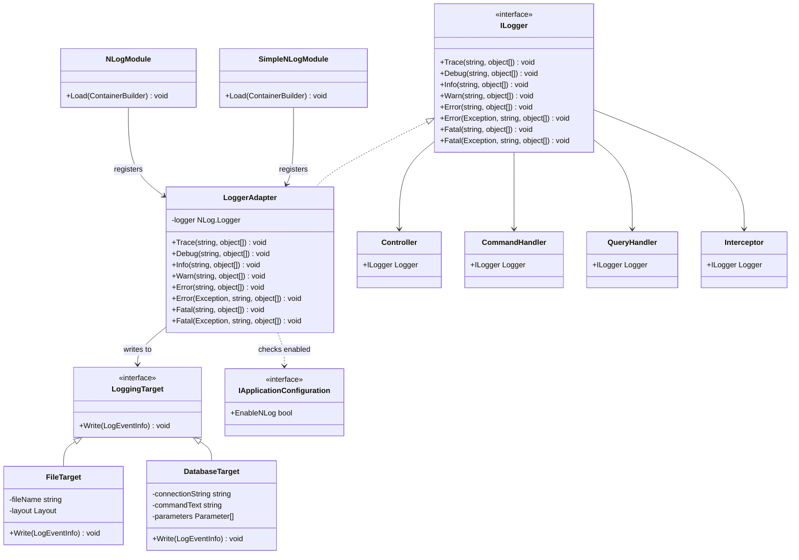
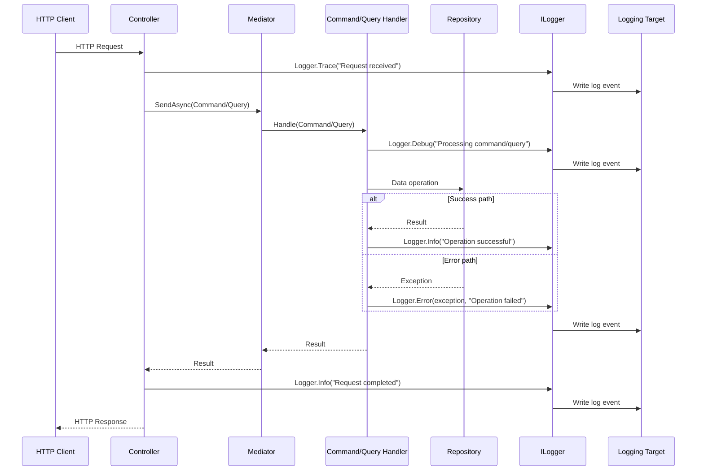

# Logging in Gringotts

This document outlines the logging architecture implemented in the Gringotts Financial application.

## Overview

Gringotts uses NLog as its primary logging framework, integrated through Autofac for dependency injection. The logging implementation follows a property injection pattern where components request logging capabilities by exposing an `ILogger` property that gets automatically wired up by the IoC container.

## Architecture Components

### Key Components

1. **ILogger** - Interface from Autofac.Extras.NLog that provides logging methods
2. **NLogModule** - Autofac module that registers NLog components
3. **SimpleNLogModule** - Simplified module for property injection in filters
4. **Logger Properties** - Properties exposed on classes that need logging capabilities
5. **Configuration** - NLog configuration in app settings and NLog.config

## Implementation

### Logger Interface

The application uses Autofac.Extras.NLog's `ILogger` interface, which provides methods for different log levels:

```csharp
public interface ILogger
{
    void Trace(string message, params object[] args);
    void Debug(string message, params object[] args);
    void Info(string message, params object[] args);
    void Warn(string message, params object[] args);
    void Error(string message, params object[] args);
    void Error(Exception exception, string message, params object[] args);
    void Fatal(string message, params object[] args);
    void Fatal(Exception exception, string message, params object[] args);
}
```

### Property Injection Pattern

Throughout the application, components expose an `ILogger` property to receive logging capabilities:

```csharp
public class ClientsController : Controller
{
    private readonly IMediator mediator;
    public ILogger Logger { get; set; }

    public ClientsController(IMediator mediator)
    {
        this.mediator = mediator;
    }
    
    public async Task<ActionResult> Index(SearchPager searchPager)
    {
        Logger.Trace("Index::{0}", searchPager);
        
        // Method implementation...
        
        Logger.Info("{0} matches found", result.Items.TotalItemCount);
        
        return View(result);
    }
}
```

### Container Integration

The logging framework is registered in the IoC container during application startup:

```csharp
public static void RegisterContainer(Action<IContainer> onReady)
{
    var builder = new ContainerBuilder();

    // Add application modules
    builder.RegisterAssemblyModules(typeof(MvcApplication).Assembly);

    // Add NLog integration modules
    builder.RegisterModule<NLogModule>();
    builder.RegisterModule<SimpleNLogModule>();
    
    // Build the container
    var container = builder.Build();
    
    // Configure dependency resolver
    DependencyResolver.SetResolver(new AutofacDependencyResolver(container));
    
    onReady(container);
}
```

### Logging Configuration

The application configures NLog through the NLog.config file, which defines log targets (file, database, etc.) and rules for routing log messages:

```xml
<nlog xmlns="http://www.nlog-project.org/schemas/NLog.xsd"
      xmlns:xsi="http://www.w3.org/2001/XMLSchema-instance">
  <targets>
    <target name="file" xsi:type="File" 
            fileName="${basedir}/logs/${shortdate}.log"
            layout="${longdate} ${level:uppercase=true} [${logger}] ${message} ${exception:format=tostring}" />
    <target name="database" xsi:type="Database"
            connectionString="${configsetting:name=ConnectionStrings.DefaultConnection}"
            commandText="INSERT INTO Logs(TimeStamp, Level, Logger, Message, Exception) 
                         VALUES (@TimeStamp, @Level, @Logger, @Message, @Exception)">
      <parameter name="@TimeStamp" layout="${date}" />
      <parameter name="@Level" layout="${level}" />
      <parameter name="@Logger" layout="${logger}" />
      <parameter name="@Message" layout="${message}" />
      <parameter name="@Exception" layout="${exception:format=tostring}" />
    </target>
  </targets>
  <rules>
    <logger name="*" minlevel="Info" writeTo="file" />
    <logger name="*" minlevel="Error" writeTo="database" />
  </rules>
</nlog>
```

### Runtime Configuration

The application allows enabling or disabling logging through application settings:

```csharp
public bool EnableNLog
{
    get
    {
        bool value;
        if (bool.TryParse(ConfigurationManager.AppSettings["app:enable_nlog"], out value))
            return value;
        return false;
    }
}
```

## Logging Patterns

### Command and Query Logging

Handlers in the CQRS pattern include logging for traceability:

```csharp
public class ClientSearchQueryHandler : IAsyncRequestHandler<ClientSearchQuery, ClientSearchResult>
{
    public ILogger Logger { get; set; }

    private readonly ISearch<Client> clients;

    public ClientSearchQueryHandler(ISearch<Client> clients)
    {
        this.clients = clients;
    }

    public async Task<ClientSearchResult> Handle(ClientSearchQuery query)
    {
        Logger.Trace("Handling client search: {0}", query.Pager);
        
        // Query implementation...
        
        Logger.Info("Found {0} client matches", result.Items.Count);
        
        return result;
    }
}
```

### Controller Action Logging

Controllers log entry and exit points of actions for request tracing:

```csharp
public async Task<ActionResult> Show(int id)
{
    Logger.Trace("Show::{0}", id);

    var query = new ClientDetailsQuery(clientId: id);
    var result = await mediator.SendAsync(query);

    if (result == null)
        return RedirectToAction("Index", new { Id = new int?() });

    return View(result);
}
```

### Error Handling and Logging

The application uses logging in exception handling scenarios:

```csharp
try
{
    // Operation that might fail
}
catch (Exception ex)
{
    Logger.Error(ex, "Failed to process client {0}", clientId);
    return new FailureResult("An unexpected error occurred");
}
```

### Contextual Logging

Interceptors provide contextual logging for cross-cutting concerns:

```csharp
public class AuditChangeInterceptor : IInterceptor
{
    public ILogger Logger { get; set; }
    
    public void BeforeSave(InterceptionContext context)
    {
        Logger.Debug("Auditing {0} changes", context.Entries.Count);
        
        // Auditing logic...
        
        Logger.Trace("Audit complete");
    }
}
```

## Class Diagram

The following class diagram illustrates the key types in the logging architecture:



## Sequence Diagram

The following sequence diagram illustrates the flow of logging through the application:



## Testing Approach

In test code, loggers are mocked using NSubstitute to verify logging behavior:

```csharp
[TestMethod]
public async Task Can_handle_client_search()
{
    // Arrange
    var mockLogger = Substitute.For<ILogger>();
    var handler = new ClientSearchQueryHandler(clients)
    {
        Logger = mockLogger
    };
    
    // Act
    var result = await handler.Handle(query);
    
    // Assert
    Assert.IsNotNull(result);
    mockLogger.Received().Trace(Arg.Any<string>(), Arg.Any<object[]>());
    mockLogger.Received().Info(Arg.Any<string>(), Arg.Any<object[]>());
}
```

## Best Practices

When working with logging in Gringotts:

1. **Use Appropriate Log Levels**
   - `Trace`: For detailed debugging information
   - `Debug`: For development-time debugging
   - `Info`: For tracking application flow
   - `Warn`: For non-critical issues
   - `Error`: For exceptions and errors
   - `Fatal`: For critical failures

2. **Include Context**
   - Log relevant IDs and parameters for traceability
   - Include enough information to understand the context
   - Format log messages for readability

3. **Performance Considerations**
   - Use string interpolation sparingly (NLog handles this efficiently)
   - Check log level before complex string formatting
   - Consider async logging for performance-critical paths

4. **Exception Handling**
   - Always log exceptions with full stack traces
   - Include contextual information with exceptions
   - Don't log sensitive information (PII, credentials, etc.)

5. **Structure**
   - Use property injection for loggers
   - Log at entry and exit points of significant operations
   - Include correlation IDs for distributed operations
