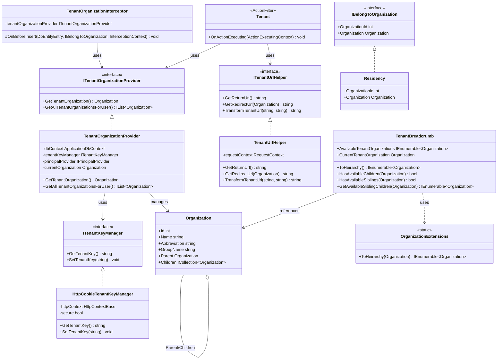
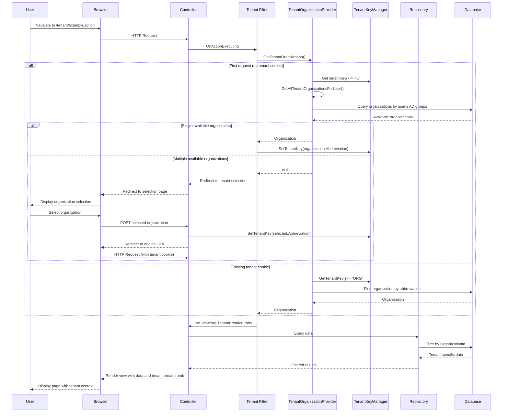

# Multi-tenancy in Gringotts

This document outlines the multi-tenancy architecture implemented in the Gringotts Financial application.

## Overview

Gringotts follows a multi-tenant architecture where a single deployment of the application serves multiple organizations (tenants). Each tenant's data is logically isolated while sharing the same infrastructure and application code.

## Hierarchical Tenant Structure

A key aspect of Gringotts' multi-tenancy is its hierarchical organization structure:

### Organization Hierarchy

```
├── Parent Organization
│   ├── Child Organization 1
│   │   ├── Grandchild Organization A
│   │   └── Grandchild Organization B
│   └── Child Organization 2
│       ├── Grandchild Organization C
│       └── Grandchild Organization D
```

Organizations in Gringotts have parent-child relationships as defined in the data model:

```csharp
public class Organization : IAmAuditable
{
    public Organization()
    {
        Created = Updated = DateTime.UtcNow;
        Children = new List<Organization>();
        Features = new List<Feature>();
    }

    public int Id { get; set; }
    public string Name { get; set; }
    public string GroupName { get; set; }
    public string Abbreviation { get; set; }
    // ...other properties...
    
    public virtual Organization Parent { get; set; }
    public virtual ICollection<Organization> Children { get; set; }
    public virtual ICollection<Feature> Features { get; set; }
}
```

### Key Implications of Hierarchical Structure

1. **Navigation**: Users can navigate across the organizational hierarchy they have access to
2. **Data Isolation**: Each organization's data is isolated, even from parent/child organizations
3. **Permissions**: Permissions can be inherited through the organizational hierarchy via AD groups

## Core Components

### Tenant Management

The application manages tenant context through several key interfaces and implementations:

#### ITenantKeyManager

Manages the tenant key (organization abbreviation) through cookies:

```csharp
public interface ITenantKeyManager
{
    string GetTenantKey();
    void SetTenantKey(string value);
}

public class HttpCookieTenantKeyManager : ITenantKeyManager
{
    // Implementation stores/retrieves tenant key from cookies
}
```

#### ITenantOrganizationProvider

Resolves the current tenant organization based on the tenant key and user permissions:

```csharp
public interface ITenantOrganizationProvider
{
    Organization GetTenantOrganization();
    IList<Organization> GetAllTenantOrganizationsForUser();
}

public class TenantOrganizationProvider : ITenantOrganizationProvider
{
    // Implementation determines what organizations the user can access
    // and which is the current active organization
}
```

#### ITenantUrlHelper

Transforms URLs to include tenant information:

```csharp
public interface ITenantUrlHelper
{
    string GetReturnUrl();
    string GetRedirectUrl(Organization organization);
    string TransformTenantUrl(string virtualPath, string tenantKey);
}
```

### Tenant Resolution Flow

1. User logs in with AD credentials
2. System determines available organizations from AD group memberships
3. If only one organization is available, it becomes the active tenant
4. Otherwise, user selects an organization from those available to them
5. Selected organization's abbreviation is stored as the tenant key in cookies
6. Tenant context is applied to all subsequent requests

### Data Access Isolation

#### Entity Interface

Organization-specific entities implement `IBelongToOrganization`:

```csharp
public interface IBelongToOrganization
{
    int OrganizationId { get; set; }
    Organization Organization { get; set; }
}
```

#### Data Interceptors

The `TenantOrganizationInterceptor` ensures entities are associated with the current tenant:

```csharp
public class TenantOrganizationInterceptor : ChangeInterceptor<IBelongToOrganization>
{
    protected override void OnBeforeInsert(DbEntityEntry entry, IBelongToOrganization item, InterceptionContext context)
    {
        if(item.Organization == null)
            item.Organization = tenantOrganizationProvider.GetTenantOrganization();

        base.OnBeforeInsert(entry, item, context);
    }
}
```

### User Interface Components

#### Tenant Navigation

The `TenantBreadcrumb` component allows users to navigate the organization hierarchy:

```csharp
public class TenantBreadcrumb
{
    public IEnumerable<Organization> AvailableTenantOrganizations { get; set; }
    public Organization CurrentTenantOrganization { get; set; }

    // Methods to traverse the hierarchy
    public IEnumerable<Organization> ToHeirarchy()
    {
        return this.CurrentTenantOrganization.ToHeirarchy();
    }

    public bool HasAvailableSiblings(Organization org) { /*...*/ }
    public bool HasAvailableChildren(Organization org) { /*...*/ }
    public IEnumerable<Organization> GetAvailableSiblingChildren(Organization org) { /*...*/ }
    // ...other helper methods...
}
```

This is rendered in `_TenantBreadcrumb.cshtml` which provides dropdown menus showing:
- Current position in the organizational hierarchy
- Sibling organizations the user can switch to
- Child organizations the user can navigate to

### Request Pipeline Components

#### Tenant Filter

The tenant filter ensures tenant context is available for routes requiring it:

```csharp
public class Tenant : ActionFilterAttribute
{
    public override void OnActionExecuting(ActionExecutingContext filterContext)
    {
        var organization = TenantOrganizationProvider.GetTenantOrganization();
        
        if (organization != null && filterContext.RouteData.Values.ContainsKey("tenant"))
        {
            // Add tenant context to ViewBag
            filterContext.Controller.ViewBag.Organization = organization;
            filterContext.Controller.ViewBag.TenantBreadcrumbs = 
                new TenantBreadcrumb{ 
                    CurrentTenantOrganization = organization, 
                    AvailableTenantOrganizations = availableOrganizations 
                };
            return;
        }

        // Redirect to tenant selection or tenant-specific URL
        // ...
    }
}
```

## Class Diagram

The following diagram illustrates the key components of the multi-tenancy architecture:



## Sequence Diagram

The following sequence diagram shows the tenant resolution and request processing flow:



## Best Practices

When working with the multi-tenancy system in Gringotts:

1. **Always check tenant context** in controllers and services that handle organization-specific data
2. **Use the TenantBreadcrumb component** to provide hierarchical navigation
3. **Implement IBelongToOrganization** on any entity that should be tenant-specific
4. **Never hard-code organization IDs** - always use the tenant context
5. **Test tenant isolation** to ensure data cannot leak between organizations
6. **Consider inheritance relationships** when designing organizational hierarchy features
7. **Use AD groups** that match organization GroupNames for authorization
